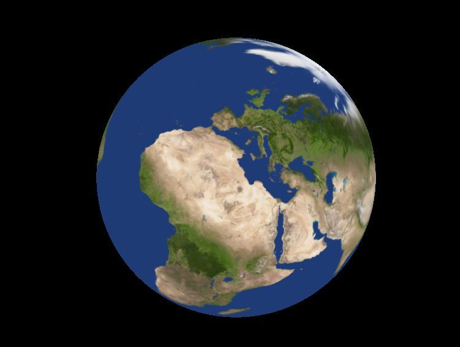

# Planets
Planets simulation engine



# How to build and run

In order to build and run the project, besides tools mentioned at the end of this file, you'll need [Git](https://git-scm.com/) and [CMake](https://cmake.org/).  

First clone the project and make the build directory:

```
git clone https://github.com/felyks473/Planets.git
cd Planets
mkdir build
cd build
```
Then get the submodules:

```
git submodule update --init --recursive
```

## Windows

You can build and run the program in Visual Studio or in Powershell in MSVC like this:


```
cmake .. -G "Visual Studio 17 2022" -A x64
cmake --build . --config Release
.\Planets\Release\Planets.exe
```

## Linux

You can build and run the program on a linux system like this:

```
cmake ..
make
./Planets/Planets
```
Or without `make`:

```
cmake ..
cmake --build .
```

Or with Ninja:

```
cmake -G Ninja ..
cmake --build .
./Planets/Planets
```

# Attribution

Earth texture is from [this](https://www.solarsystemscope.com/textures/) website and is licensed under [CC BY 4.0](https://creativecommons.org/licenses/by/4.0/)

This project uses stb_image which you can find [here](https://github.com/nothings/stb) which licenses you can find [here](https://github.com/nothings/stb/blob/master/LICENSE)

This project uses:

[glfw](https://www.glfw.org/)               --- [license](https://github.com/glfw/glfw/blob/master/LICENSE.md),  
[glad](https://glad.dav1d.de/)              --- [license](https://github.com/Dav1dde/glad/blob/glad2/LICENSE),  
[spdlog](https://github.com/gabime/spdlog)  --- [license](https://github.com/gabime/spdlog/blob/v1.x/LICENSE),  
[glm](https://github.com/g-truc/glm)        --- [license](https://github.com/g-truc/glm/blob/master/copying.txt)  
